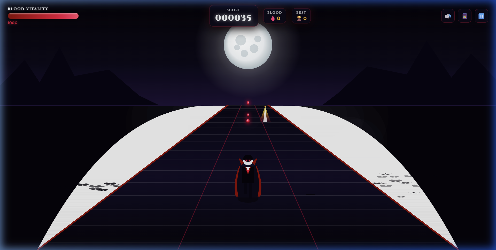
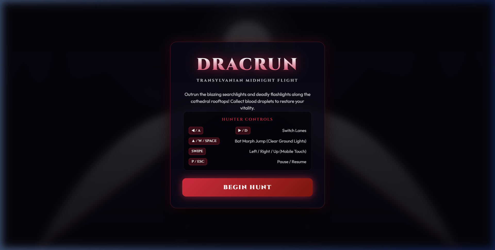

# 🧛‍♂️ DracRun — Gothic 3D Endless Runner

An action-packed, 3D perspective gothic endless runner web game built with pure **HTML5 Canvas**, **Vanilla JavaScript**, and **Web Audio API**.



---

## 📸 Screenshots

|               Start Screen               |             Gameplay Action             |
| :--------------------------------------: | :-------------------------------------: |
|  |  |

---

## 📜 Description

In **DracRun**, you take control of Count Dracula sprinting across Transylvanian cathedral rooftops and cobblestone tracks under a glowing moonlit midnight sky. Heavy searchlights and flickering flashlights cast intense, burning beams across the lanes.

Your goal is to survive as long as possible, dodge lethal searchlight beams, collect ruby blood droplets to replenish your **Blood Vitality**, and transform into a vampire bat to sail over ground obstacles!

### Key Features

- 🌌 **Gothic Dark Mode Art Direction**: Procedural full moon with crater shading, glowing bloom, castle spires, gargoyles, drifting fog mist, and flapping moonlit bats.
- 🦇 **Bat Morph Transformation**: Morph into a vampire bat with shadow smoke particles when jumping to clear low-ground flashlights.
- 🔦 **Flickering Flashlights & Searchlights**: Avoid low ground flashlights and tall vertical searchlight sweeps that burn your HP.
- 🩸 **Blood Vitality & Pickups**: Collect ruby blood droplets along parabolic jump arcs to heal and score points.
- 🔊 **100% Procedural Web Audio API**: All sound effects and the ambient gothic drone soundtrack are synthesized natively in code—no external `.mp3` or `.wav` assets required!
- ⚡ **High-Performance Object Pooling**: Optimized `requestAnimationFrame` game loop with `deltaTime` normalization for silky smooth 60fps/120fps gameplay.

---

## 🚀 How to Try It

### Prerequisites

- [Node.js](https://nodejs.org/) (v16 or higher)
- `npm` package manager

### Running Locally

1. **Clone the repository:**

   ```bash
   git clone https://github.com/2300031005/dracrun.git
   cd dracrun
   ```

2. **Install dependencies:**

   ```bash
   npm install
   ```

3. **Start the local development server:**

   ```bash
   npm run dev
   ```

4. **Play the game:**
   Open your browser and navigate to `http://localhost:5173`.

---

## 🎮 Controls

| Action               | Desktop Keyboard             | Mobile Touch / Gesture           |
| :------------------- | :--------------------------- | :------------------------------- |
| **Move Left**        | `◀ Left Arrow` / `A`         | Swipe Left                       |
| **Move Right**       | `▶ Right Arrow` / `D`        | Swipe Right                      |
| **Jump (Bat Morph)** | `▲ Up Arrow` / `W` / `Space` | Swipe Up / On-Screen Jump Button |
| **Pause / Resume**   | `P` / `Esc`                  | Pause Button (HUD)               |

---

## 🛠️ Technologies & Tools

- **Core Logic**: Pure Vanilla JavaScript (ES Modules).
- **Rendering Engine**: HTML5 Canvas 2D with custom pseudo-3D perspective projection math `(x, y, z) => (screenX, screenY, scale)`.
- **Audio Synthesizer**: Native Web Audio API (`AudioContext`, `OscillatorNode`, `BiquadFilterNode`, `GainNode`, custom white noise buffer).
- **Styling**: Vanilla CSS3 featuring glassmorphism (`backdrop-filter: blur()`), custom gothic typography, and responsive viewport sizing.
- **Build System**: [Vite](https://vitejs.dev/) for instant dev module reloading and production bundling.

---

## 🏆 Developer Notes & Bragging Rights

- **Zero External Asset Dependencies**: Every single graphic (Dracula, bats, full moon, castle silhouettes, cobblestones, blood drops, fog particles) and sound effect (pickup chime, wing flap whoosh, sizzle hiss, gong hit, gothic drone) is **100% procedurally generated** in runtime code.
- **Zero Garbage Collection Lag**: Pre-allocated object pools for flashlights, searchlights, blood droplets, and environmental particles guarantee zero allocations during active gameplay, keeping frame rates pinned at 60fps/120fps.
- **Persistent High Scores**: Automatically saves your best high score to `localStorage`.

---

## 💡 Inspiration

_DracRun_ was born at 3:14 AM from a sudden burst of inspiration: combining the haunting gothic aesthetic of classic _Castlevania_ with the fast-paced, 3-lane perspective mechanics of _Subway Surfers_.

The challenge was to build a complete, atmospheric 3D runner using **pure web standards** without loading heavy 3D game engines or bloated asset packs. The result is a lightweight, responsive gothic speedrun experience!
